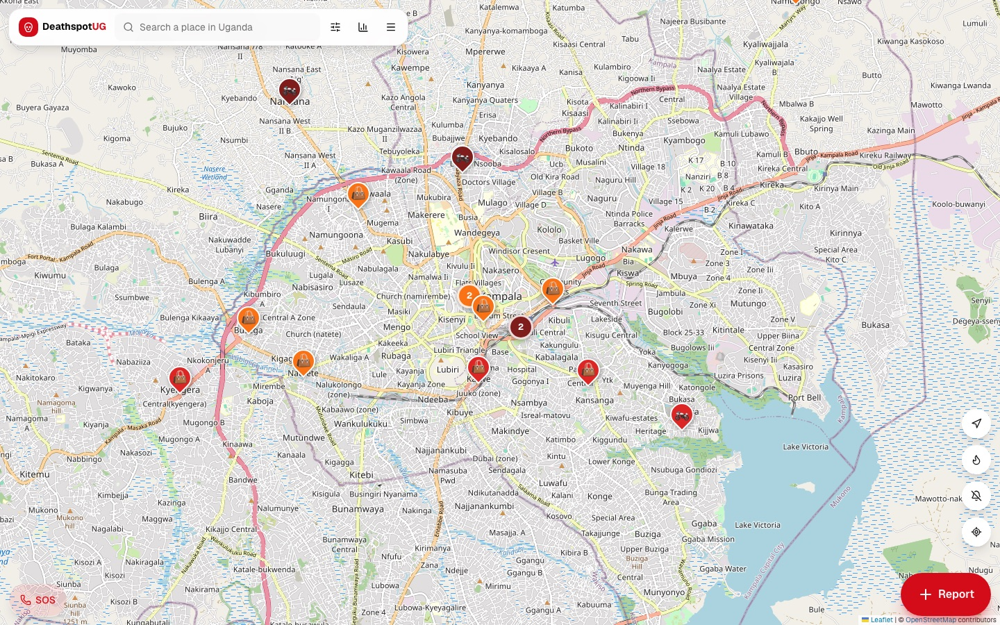
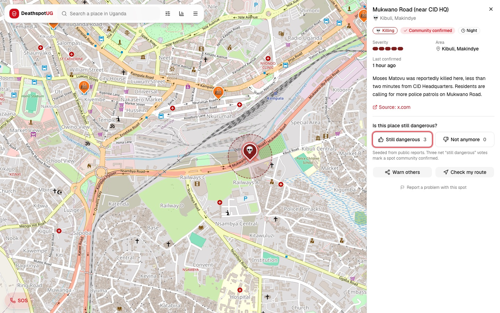
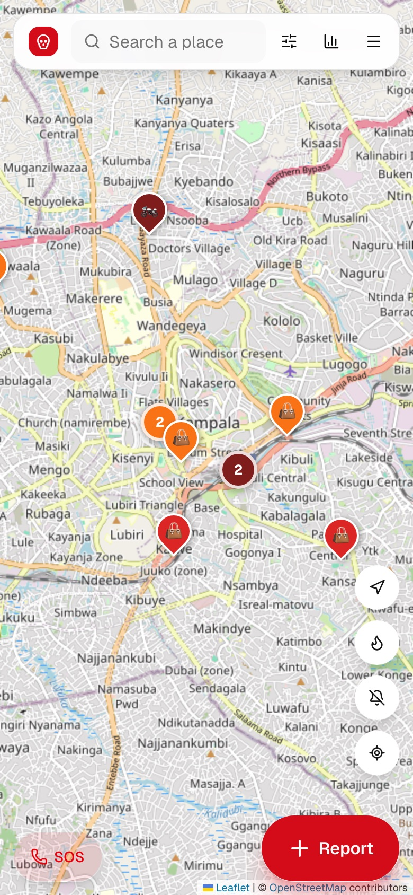
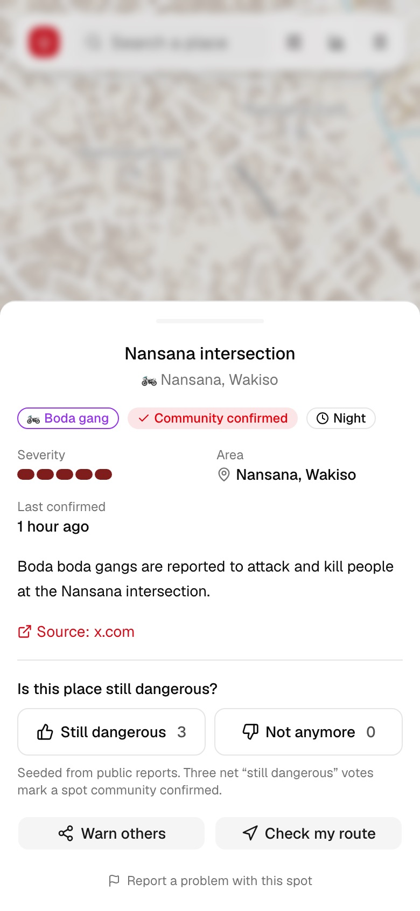
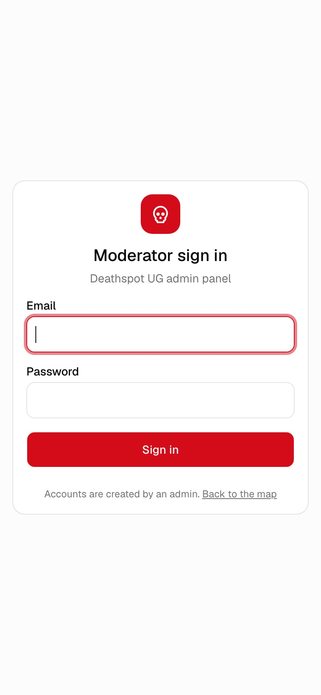

<div align="center">

# 💀 Deathspot UG

**A community-led danger map for Uganda. Know where people are being attacked and killed, and avoid those places.**

Think *Waze*, but for danger.

[Why](#why-deathspot) · [Inspiration](#the-inspiration) · [Screenshots](#screenshots) · [How it works](#how-it-works) · [Contribute](#how-you-can-contribute) · [Tech stack](#tech-stack) · [Roadmap](#roadmap) · [Run it](#getting-started)

   



</div>

---

## Why Deathspot?

Uganda Police's **Annual Crime Report 2025** recorded **4,328 people deliberately killed**, about **11 murders every day**. Assault (1,326 deaths) and mob action (950 deaths) were the leading causes, followed by strangulation, hacking, stabbing and blunt-force attacks. Adding road deaths, roughly **25 Ugandans die from these causes every day**.

These killings don't happen at random. They cluster at dark junctions, boda stages where gangs wait, busy taxi parks at rush hour, and stretches of road with no patrols. **The people who live nearby know exactly where these places are.** Visitors, students, new residents and night-shift workers usually don't, until it's too late.

That knowledge is scattered across WhatsApp groups, X threads and word of mouth. Deathspot UG gathers it in one place:

- **A shared map** that anyone can add to and anyone can check before they travel.
- **Community verification** so warnings stay current: spots are confirmed when others say they're still dangerous, and fade when they say it's improved.
- **Practical tools**: check your route before a boda ride, get a warning when you're approaching a danger spot, and call for help in one tap.

The aim isn't fear. It's **informed movement**: choosing another route, travelling in daylight, not walking alone, and pushing for patrols where they're needed most.

## The inspiration

In September 2026, **Moses Matovu was killed less than two minutes from CID Headquarters** in Kampala. Anthony Natif ([@TonyNatif](https://x.com/TonyNatif/status/2102998432218534245)) asked people to *"think about that"* and then did something useful. He tagged the police and listed the hotspots residents already knew:

> Mukwano Road and the EC area · Kiwologoma · Katwe next to Banyakitara church · Kato–Kinyoro · Kikubamutwe near the police barracks · Kalerwe and the Nansana intersection, where *"bodas kill several people there."*

He ended with *"People will add more spots."*

Deathspot UG is built so that people **can** add more spots, in a structured, moderated and privacy-respecting way that the whole country can use. Every spot from that post is on the map, alongside hotspots named in police statements, each linked to its source.

## Screenshots

<table>
  <tr>
    <td width="68%"></td>
    <td width="32%"></td>
  </tr>
  <tr>
    <td><b>Spot details on desktop</b>: severity, source, community confirmation, share and route check.</td>
    <td><b>Mobile map</b>: thumb-reachable Report, SOS and map controls.</td>
  </tr>
</table>

<table>
  <tr>
    <td width="33%"></td>
    <td width="33%"></td>
    <td width="34%"></td>
  </tr>
  <tr>
    <td><b>Spot details on a phone</b>: confirm, deny, warn others.</td>
    <td><b>Moderator sign-in</b> for the admin panel.</td>
    <td></td>
  </tr>
</table>

## How it works

| | |
|---|---|
| 🗺️ **Live danger map** | Pins coloured by severity. They cluster when zoomed out, with a heatmap view to see hotspots at a glance. |
| ➕ **Report in two taps** | Tap *Report*, drop a pin (or use GPS), and say what happened and when it's dangerous. No account needed. |
| 👍 **Waze-style confirmation** | Voters answer *Still dangerous* or *Not anymore*. Three net confirmations mark a spot **community confirmed**. |
| 🧭 **Route check** | Enter where you're going and see every reported spot within 150 m of each route option, safest first. |
| 🔔 **Nearby alerts** | With location on, the phone buzzes when you're within 300 m of a danger spot. |
| 🚩 **Report a problem** | Flag pins that are wrong, duplicated, abusive, or that name a person. Enough flags hide a pin until a moderator checks it. |
| 🛡️ **Moderation** | Volunteer moderators review new and flagged reports, fix details, mark spots **verified**, and every action is logged. |
| 🆘 **SOS** | One tap to call 999, 112, the National Emergency Call Centre, or police WhatsApp. |
| 📤 **Warn others** | Share any spot as a link on WhatsApp. |

### Ground rules

1. **Report places, never people.** Don't name, describe or accuse anyone. Phone numbers are stripped automatically, and moderators remove anything that targets a person.
2. **Report what you saw or what was credibly reported.** Add a news or police link when you can.
3. **Community reports can be wrong.** Treat them as warnings, not evidence.
4. **This map does not replace the police.** Always report crimes to them too.

## How you can contribute

You don't need to be a developer to help.

### 🧍 Everyone
- **Report spots** you know are dangerous, and **confirm or deny** existing ones when you pass by. Fresh votes keep the map honest.
- **Flag** anything wrong, duplicated or harmful.
- **Share** the map in your estate, campus, church and WhatsApp groups. More eyes mean better warnings.

### 🛡️ Moderators
We need trusted volunteers, ideally spread across Kampala, Wakiso, Mukono and upcountry districts, to review reports every day. Moderators should know their area, be fair, and follow the ground rules. Open an issue titled **"Moderator volunteer"** saying which areas you know.

### 📚 Researchers & journalists
Help us **seed well-sourced data**. Spots in [`data/seed.json`](data/seed.json) are loaded into every new installation. Each entry needs an approximate location, a category, a severity, and a **public source** (a police statement, reputable news, or a court record):

```json
{
  "title": "Nansana intersection",
  "description": "Boda boda gangs are reported to attack and kill people at the intersection.",
  "lat": 0.36582, "lng": 32.52923, "area": "Nansana, Wakiso",
  "category": "boda_gang", "severity": 5, "time_of_day": "night",
  "source_url": "https://…"
}
```

Categories: `murder`, `mob_action`, `boda_gang`, `robbery`, `stabbing`, `kidnapping`, `other`. Severity runs from 1 (feels unsafe) to 5 (someone was killed).

### 💻 Developers & designers
1. Pick an issue, or something from the [roadmap](#roadmap), and comment that you're on it.
2. Fork, create a branch (`feat/…`, `fix/…`), and follow [Getting started](#getting-started).
3. Keep changes focused, match the existing code style, and run `pnpm lint && npx tsc --noEmit && pnpm build` before opening a PR.
4. **Schema changes** go in a new numbered file in [`supabase/migrations/`](supabase/migrations). Never edit an existing migration. Every table needs row-level security.
5. **Test on a phone-sized screen.** Most people will use Deathspot on a mid-range Android phone over mobile data.
6. In the PR, describe what changed and how you tested it. Include screenshots for UI changes.

### 🌍 Translators
Luganda, Swahili, Runyankore-Rukiga, Luo, Lusoga, Ateso and more. See the roadmap. We'll add an i18n structure you can fill in.

## Tech stack

| Layer | Choice |
| --- | --- |
| Frontend | [Next.js 16](https://nextjs.org) (App Router), React 19, TypeScript |
| UI | [shadcn/ui](https://ui.shadcn.com) (Radix), Tailwind CSS v4, lucide icons, Vaul drawers, Sonner toasts |
| Maps | [Leaflet](https://leafletjs.com) + react-leaflet, marker clustering, heatmap, OpenStreetMap tiles |
| Search & routing | OSM [Nominatim](https://nominatim.org) (Uganda only), [OSRM](https://project-osrm.org) with alternative routes |
| Backend | **Self-hosted [Supabase](https://supabase.com)**: Postgres 17, GoTrue auth (moderators), PostgREST, Envoy gateway, Studio |
| Security | Row-level security on every table, security-definer functions for writes, audit log, salted visitor hashes, rate limits, zod validation |
| Deployment | Docker Compose on any VPS, with optional Caddy for automatic HTTPS |

### Architecture

```
            ┌─────────── docker compose ───────────────────────────────────────┐
 browser ──▶│ caddy (https, optional) ──▶ app (Next.js · shadcn/ui · Leaflet)  │
            │                                   │ supabase-js (server only)    │
            │                                   ▼                              │
            │           api-gw (Envoy) ──▶ auth (GoTrue) · rest (PostgREST)    │
            │               │                        │                         │
            │               └──▶ studio + meta       ▼                         │
            │                                  db (supabase/postgres 17)       │
            └──────────────────────────────────────────────────────────────────┘
```

- **The browser never talks to Supabase directly.** Next.js API routes validate input, rate-limit, and hash the visitor, then call Postgres functions.
- **The anon role can read only approved spots** and only their public columns.
- **Moderators act with their own JWT.** Database functions check `is_moderator()` / `is_admin()` and write to `moderation_log`.
- **On startup** the app applies migrations, seeds `data/seed.json` once, and creates the first admin (see [`lib/bootstrap.ts`](lib/bootstrap.ts)).

### Project layout

```
app/                 pages, API routes (app/api), admin panel (app/admin)
components/          map, report/route/flag UI, admin components, shadcn/ui
lib/                 data access (db.ts, admin.ts), Supabase clients, geo, validation
supabase/migrations  schema, RLS policies and moderation functions
data/seed.json       sourced starting spots
docker/              Supabase gateway + db init config, Caddyfile
```

## Roadmap

Improvements we plan to make. Contributions are welcome on any of these.

**Reach & access**
- [ ] 🌍 **Local languages**: Luganda first, then Swahili, Runyankore-Rukiga, Luo, Lusoga, Ateso.
- [ ] 📱 **Installable PWA with offline mode**: cache the map and danger spots for patchy connections.
- [ ] 💬 **USSD / SMS & WhatsApp bot**: report and check areas from feature phones (e.g. `*xxx#` → "Is Kalerwe safe tonight?").
- [ ] 🪶 **Data-light mode**: vector tiles, smaller bundles, and fewer requests for low-end Android phones.

**Safety features**
- [ ] 🧭 **True "avoid danger" routing**: route *around* spots (a custom OSRM/Valhalla profile) instead of only flagging them.
- [ ] 🕒 **Time-aware risk**: weight spots by time of day, so night-only spots matter less at noon.
- [ ] 📍 **Share my trip**: send a live location link to a trusted contact for a boda or night walk.
- [ ] 🔔 **Area watch**: subscribe to an estate or route and get push/SMS alerts about new confirmed spots.
- [ ] ⚡ **Live updates** with Supabase Realtime instead of polling.

**Trust & data quality**
- [ ] 🧑‍⚖️ **Moderator reputation & regions**: assign moderators to districts and track review times.
- [ ] 🤖 **Duplicate & abuse detection**: merge nearby duplicates, and catch names and accusations before publishing.
- [ ] 📸 **Evidence attachments** (with face/plate blurring) via Supabase Storage.
- [ ] ⏳ **Decay**: spots with no recent confirmations fade out automatically.
- [ ] 🔐 Moderator **2FA** and SMTP-based password resets.

**Impact & transparency**
- [ ] 📊 **Public open-data dashboard & API**: trends by district, category and time for journalists, researchers and policymakers.
- [ ] 🚓 **Patrol request reports**: a monthly, source-linked hotspot summary to share with the police and local leaders.
- [ ] 🗂️ Import historical data from the UPF Annual Crime Reports.

**Engineering**
- [ ] ✅ Test suite: unit tests (geo, validation), SQL tests for RLS and functions, and Playwright end-to-end tests on mobile viewports.
- [ ] 🔁 CI with GitHub Actions (lint, typecheck, build, migrations against an ephemeral Postgres) and published Docker images.
- [ ] 🗺️ Self-hosted tiles, geocoding and routing to stay within OSM usage policies at scale.
- [ ] 🛡️ Distributed rate limiting (Postgres/Redis) for multi-replica deployments.

Have an idea? Open an issue.

## Getting started

### Local development

Requirements: Node 20+, pnpm, Docker.

```bash
pnpm install
pnpm setup:env      # creates .env with fresh secrets (prints the admin + Studio logins)
pnpm supabase:up    # Postgres, Auth, PostgREST, gateway and Studio in Docker
pnpm dev            # http://localhost:3000; migrates + seeds on start
```

| URL | What |
| --- | --- |
| http://localhost:3000 | The map |
| http://localhost:3000/admin | Moderation panel. Login is `ADMIN_EMAIL` / `ADMIN_PASSWORD` from `.env`. |
| http://localhost:8000 | Supabase Studio. Login is `DASHBOARD_USERNAME` / `DASHBOARD_PASSWORD`. |

- Run the full stack in containers: `docker compose up -d --build`.
- Wipe all local data: `docker compose down -v`.

### Deploy on a VPS

Requirements: a Linux VPS with 2 GB+ RAM, Docker with the compose plugin, and a domain pointed at the server.

```bash
git clone https://github.com/mwanjajoel/deathspot.git && cd deathspot
node scripts/setup-env.mjs
```

Edit `.env`:

| Variable | Set to |
| --- | --- |
| `ADMIN_EMAIL` / `ADMIN_PASSWORD` | Your first admin login. Change the password after signing in. |
| `APP_DOMAIN`, `SUPABASE_DOMAIN`, `ACME_EMAIL` | e.g. `deathspot.ug`, `supabase.deathspot.ug`, your email |
| `SITE_URL` | `https://$APP_DOMAIN` |
| `SUPABASE_PUBLIC_URL` / `API_EXTERNAL_URL` | `https://$SUPABASE_DOMAIN` and `https://$SUPABASE_DOMAIN/auth/v1` |
| `APP_BIND` | `127.0.0.1`, so only Caddy can reach the app |
| `NOMINATIM_USER_AGENT` | Your site and contact email (required by OSM policy) |

```bash
docker compose --profile https up -d --build
docker compose logs -f app          # wait for "[bootstrap] ready"
```

Open only ports 22, 80 and 443. Postgres (55432) and the gateway (8000) listen on localhost only. Keep the app behind Caddy or Cloudflare: visitor identity comes from `CF-Connecting-IP` / `X-Forwarded-For`, which clients can spoof if port 3000 is exposed directly.

### Operations

```bash
docker compose ps                                                                     # service health
docker compose pull && docker compose up -d --build                                   # update
docker compose exec db pg_dump -U postgres -d postgres -Fc > backup-$(date +%F).dump  # backup
docker compose exec -T db pg_restore -U postgres -d postgres --clean < backup.dump     # restore
```

### API

| Method | Route | |
| --- | --- | --- |
| GET | `/api/spots?category=&since=` | Approved spots |
| POST | `/api/spots` | Report a spot (validated, must be inside Uganda, 5/hour). Returns `pending: true` when approval is required. |
| POST | `/api/spots/:id/vote` | `{ "value": 1 \| -1 }` |
| POST | `/api/spots/:id/flag` | `{ "reason": "inaccurate" \| "names_person" \| "duplicate" \| "abusive" \| "resolved" \| "other", "note"? }` |
| GET | `/api/route?from=lat,lng&to=lat,lng` | Routes with the danger spots along each |
| GET | `/api/geocode?q=` | Place search (Uganda only) |
| GET | `/api/stats`, `/api/health` | Insights and health check |

## Privacy

- There are **no public accounts**. Visitors are identified only by a salted hash of IP + user agent, used for one vote per spot and for rate limits. Raw IPs are never stored, and hashes are never exposed.
- No names, photos or phone numbers of individuals are collected.
- Moderation is accountable: every action is logged with the moderator and a reason.

## License

Deathspot UG is open source under the [MIT License](LICENSE). You're free to use, adapt and redeploy it, including for other cities and countries. Please keep the copyright notice, and keep to the spirit of the ground rules: **places, not people**.

The seed data in `data/seed.json` summarises publicly reported information; follow each entry's `source_url` for the original reporting.

## Sources

- [@TonyNatif on X](https://x.com/TonyNatif/status/2102998432218534245) (September 2026)
- [AllAfrica / Daily Monitor: Crime Report 2025, 25 Ugandans killed daily](https://allafrica.com/stories/202603310303.html)
- [UG Mirror: police name Kampala Metropolitan hotspots](https://ugmirror.com/index.php/2026/02/17/crime-wave-rocks-kampala-metropolitan-area-as-police-name-hotspots-arrest-over-250-suspects/)
- [AllAfrica: police crackdown on Kampala hotspots](https://allafrica.com/stories/202601130514.html)
- [The Observer: police report unmasks Uganda's top crimes](https://observer.ug/news/police-report-unmasks-ugandas-7-top-crimes/)
- [Uganda Police Force](https://upf.go.ug/)

Map data © [OpenStreetMap](https://www.openstreetmap.org/copyright) contributors.

---

<div align="center">

**If a crime has just happened, call 999 or 112 first.**

Built by the community, for the community. 🇺🇬

</div>
